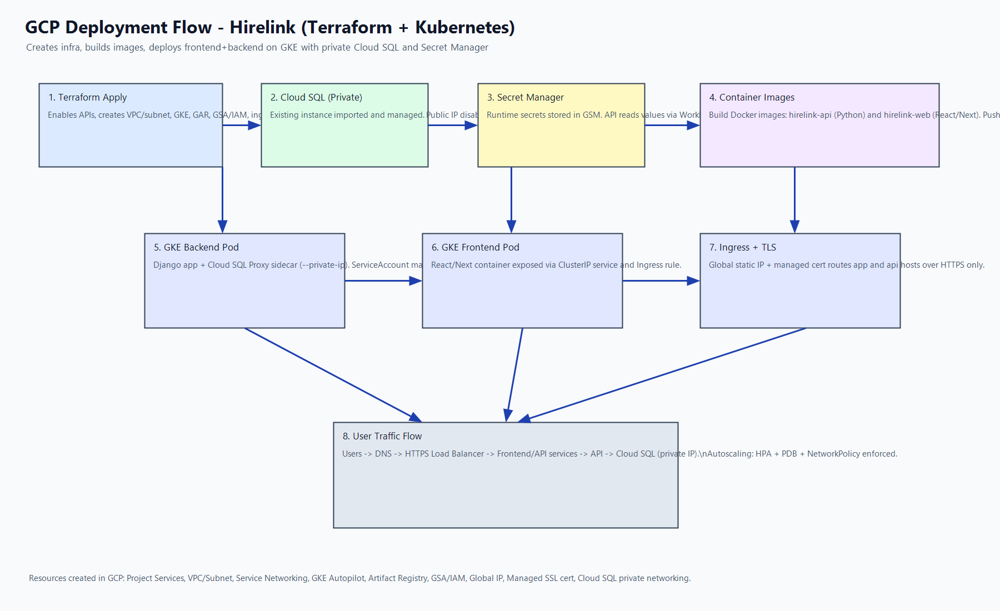

# Task 1 Terraform: GCP Infra + App Deployment Flow

This folder provisions GCP infrastructure for Hirelink and supports deployment of:

- Frontend: React/Next.js container (`hirelink-web`)
- Backend: Python/Django container (`hirelink-api`)
- Database: Cloud SQL PostgreSQL (private networking)
- Secrets: Google Secret Manager (read by backend via Workload Identity)



## What Terraform Creates in GCP

Always created:

1. `google_project_service.required`
2. `google_compute_network.gke`
3. `google_compute_subnetwork.gke`
4. `google_container_cluster.primary` (GKE Autopilot)
5. `google_artifact_registry_repository.docker`
6. `google_service_account.workload`
7. `google_project_iam_member.workload_secret_accessor`
8. `google_project_iam_member.workload_sql_client`
9. `google_service_account_iam_member.workload_identity_user`
10. `google_compute_global_address.ingress`
11. `google_compute_managed_ssl_certificate.ingress`
12. `google_dns_record_set.app_domain` (optional)
13. `google_dns_record_set.api_domain` (optional)
14. `google_dns_managed_zone.primary` (optional, when `create_dns_zone = true`)

Created when `create_cloud_sql = true`:

1. `google_compute_global_address.private_services_range`
2. `google_service_networking_connection.private_vpc_connection`
3. `google_sql_database_instance.postgres[0]`

Created when `manage_cloud_sql_database_and_user = true`:

1. `random_password.cloud_sql_app_password[0]`
2. `google_sql_database.app[0]`
3. `google_sql_user.app[0]`

## Your Current Case (Existing Cloud SQL)

You already have:

- Connection name: `deadbots:us-central1:hirelink-production-db`
- Public IP currently enabled

Use this Terraform stack to:

1. Import that existing instance into state.
2. Disable public IP.
3. Use private networking (`private_network`) through VPC peering.
4. Keep deletion protection enabled.

## Files

- `versions.tf`: Terraform version/provider config
- `variables.tf`: Input variables
- `main.tf`: Resource definitions
- `outputs.tf`: Deployment outputs
- `terraform.tfvars.example`: Example variable values
- `assets/gcp-deployment-flow.png`: Architecture/deployment flow image

## Complete Deployment Flow (Step by Step)

1. Authenticate

```powershell
gcloud auth login
gcloud config set project deadbots
gcloud auth application-default login
gcloud auth application-default set-quota-project deadbots
```

2. Create secure Terraform state bucket (one-time)

```powershell
gcloud storage buckets create gs://deadbots-tfstate-prod-hirelink --project=deadbots --location=us-central1 --uniform-bucket-level-access
gcloud storage buckets update gs://deadbots-tfstate-prod-hirelink --pap
gcloud storage buckets update gs://deadbots-tfstate-prod-hirelink --versioning
```

`backend.tf` is already configured to use this bucket:

- bucket: `deadbots-tfstate-prod-hirelink`
- prefix: `hirelink/task1-gke/prod`

3. Initialize backend and migrate local state

```powershell
terraform init -reconfigure -migrate-state -force-copy
```

4. Prepare variables

```powershell
cd D:\cloud-native-platform\hirelink-api\assessment\task1-gke\terraform
Copy-Item .\terraform.tfvars.example .\terraform.tfvars
```

Set these values in `terraform.tfvars`:

```hcl
project_id = "deadbots"
region = "us-central1"

create_cloud_sql = true
cloud_sql_instance_name = "hirelink-production-db"
cloud_sql_enable_public_ip = false
cloud_sql_deletion_protection = true
manage_cloud_sql_database_and_user = false

# Optional: manage Cloud DNS A records for app/api domains
create_dns_records = true
dns_managed_zone   = "niranjan-cloud-zone"
dns_ttl            = 300
# If zone does not exist yet, let Terraform create it:
create_dns_zone    = true
dns_zone_dns_name  = "niranjan.cloud."
```

If your registrar manages DNS (not Cloud DNS authoritative), keep:

```hcl
create_dns_records = false
```

and create hoster records manually:

- `app.niranjan.cloud` A -> `34.13.122.211`
- `api.niranjan.cloud` A -> `34.13.122.211`

5. Initialize + import existing Cloud SQL

```powershell
terraform init
terraform import -var="project_id=deadbots" 'google_sql_database_instance.postgres[0]' 'projects/deadbots/instances/hirelink-production-db'
```

6. Plan and apply infra

```powershell
terraform plan -var-file="terraform.tfvars"
terraform apply -var-file="terraform.tfvars"
```

7. Verify Cloud SQL became private

```powershell
gcloud sql instances describe hirelink-production-db --project deadbots --format="yaml(name,connectionName,settings.ipConfiguration.ipv4Enabled,settings.ipConfiguration.privateNetwork,ipAddresses)"
```

Expected:

- `ipv4Enabled: false`
- `privateNetwork` present
- no public IP entry

8. Build and push images

```powershell
gcloud auth configure-docker us-central1-docker.pkg.dev
IMAGE_TAG=v1.1.1

cd D:\cloud-native-platform\hirelink-api
docker build -t us-central1-docker.pkg.dev/deadbots/hirelink/hirelink-api:${IMAGE_TAG} .
docker push us-central1-docker.pkg.dev/deadbots/hirelink/hirelink-api:${IMAGE_TAG}

cd D:\cloud-native-platform\hirelink
docker build -t us-central1-docker.pkg.dev/deadbots/hirelink/hirelink-web:${IMAGE_TAG} .
docker push us-central1-docker.pkg.dev/deadbots/hirelink/hirelink-web:${IMAGE_TAG}
```

9. Deploy Kubernetes workloads

```powershell
cd D:\cloud-native-platform\hirelink-api
.\assessment\task1-gke\deploy-gke.ps1 -ProjectId deadbots -Region us-central1 -ClusterName hirelink-prod-cluster -RepoName hirelink -BackendImageTag v1.1.1 -FrontendImageTag v1.1.1
```

10. Validate runtime

```powershell
kubectl -n hirelink-prod get pods,svc,ingress,hpa,pdb,networkpolicy
kubectl -n hirelink-prod logs deploy/hirelink-api -c app --tail=100
```

11. Verify certificate visibility

```powershell
nslookup app.niranjan.cloud
nslookup api.niranjan.cloud
gcloud compute ssl-certificates describe hirelink-managed-cert --global --project deadbots --format="get(managed.status,managed.domainStatus)"
```

If `domainStatus` is `FAILED_NOT_VISIBLE`, DNS is still not globally visible to Google CA.

## Secret Manager Integration

Your backend reads secrets from Secret Manager (`*_PROD` naming), including:

- `CLOUD_SQL_CONNECTION_NAME_PROD`
- `DB_HOST_PROD`
- `DB_NAME_PROD`
- `DB_USER_PROD`
- `DB_PASSWORD_PROD`
- `DB_PORT_PROD`
- `DB_SSLMODE_PROD`
- `DJANGO_SECRET_KEY_PROD`
- `EMAIL_HOST_PASSWORD_PROD`
- `GOOGLE_CLIENT_ID_PROD`
- `GOOGLE_CLIENT_SECRET_PROD`
- `RAZORPAY_KEY_ID_PROD`
- `RAZORPAY_KEY_SECRET_PROD`
- `RAZORPAY_WEBHOOK_SECRET_PROD`
- `GCS_CREDENTIALS_JSON_PROD`

For direct private-IP DB mode, keep:

- `USE_CLOUD_SQL_PROXY_PROD=false`
- `DB_HOST_PROD=10.114.0.4`
- `DB_PORT_PROD=5432`
- `DB_SSLMODE_PROD=require`

`assessment/task1-gke/k8s/base/02-configmap.yaml` is intentionally kept free of these DB/GCP runtime keys.

## Notes

- Backend pod connects directly to Cloud SQL private IP.
- App/API can stay public through HTTPS ingress; database stays private.
- Keep `cloud_sql_deletion_protection = true` for production safety.
- HTTP/HTTPS behavior for domains is controlled by Kubernetes Ingress/FrontendConfig manifests (not Terraform).
  - Test mode: `allow-http: "true"` and `redirectToHttps.enabled: false`
  - Production mode: `allow-http: "true"` and `redirectToHttps.enabled: true`

## Quick Commands (Future Reference)

```powershell
# Terraform apply
cd D:\cloud-native-platform\hirelink-api\assessment\task1-gke\terraform
terraform plan -var-file="terraform.tfvars"
terraform apply -var-file="terraform.tfvars"

# K8s credentials
gcloud container clusters get-credentials hirelink-prod-cluster --region us-central1 --project deadbots

# Runtime DB secrets (direct private IP)
echo false | gcloud secrets versions add USE_CLOUD_SQL_PROXY_PROD --data-file=-
echo 10.114.0.4 | gcloud secrets versions add DB_HOST_PROD --data-file=-
echo 5432 | gcloud secrets versions add DB_PORT_PROD --data-file=-
echo require | gcloud secrets versions add DB_SSLMODE_PROD --data-file=-

# Build + deploy
gcloud auth configure-docker us-central1-docker.pkg.dev
$IMAGE_TAG="v1.1.1"

cd D:\cloud-native-platform\hirelink-api
docker build -t us-central1-docker.pkg.dev/deadbots/hirelink/hirelink-api:$IMAGE_TAG .
docker push us-central1-docker.pkg.dev/deadbots/hirelink/hirelink-api:$IMAGE_TAG

cd D:\cloud-native-platform\hirelink
docker build -t us-central1-docker.pkg.dev/deadbots/hirelink/hirelink-web:$IMAGE_TAG .
docker push us-central1-docker.pkg.dev/deadbots/hirelink/hirelink-web:$IMAGE_TAG

cd D:\cloud-native-platform\hirelink-api
.\assessment\task1-gke\deploy-gke.ps1 -ProjectId deadbots -Region us-central1 -ClusterName hirelink-prod-cluster -RepoName hirelink -BackendImageTag $IMAGE_TAG -FrontendImageTag $IMAGE_TAG
```
