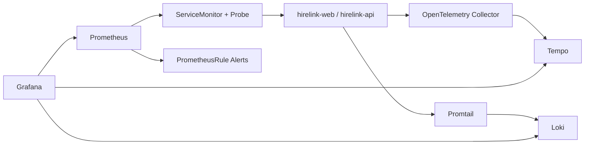

# Task 3: Monitoring, Logging & Observability

This task implements a complete observability baseline for `hirelink-prod`:

- Metrics + alerts: Prometheus Operator (`kube-prometheus-stack`)
- Dashboards: Grafana
- Logs: Loki + Promtail
- Tracing: Tempo + OpenTelemetry Collector
- Uptime probing: Prometheus blackbox exporter

## Architecture



## Files Included

- `manifests/servicemonitor.yaml`
  - Service discovery for `hirelink-api` and `hirelink-web`
  - Public endpoint probing (`Probe`) for `app.niranjan.cloud` and `api.niranjan.cloud`
- `manifests/prometheus-rules.yaml`
  - Pod restart, deployment availability, CPU/memory pressure, SLO burn-rate alerts
- `manifests/otel-collector.yaml`
  - OTLP receiver + export to Tempo
- `manifests/loki-ruler-configmap.yaml`
  - Log-based alert rule example for API error spikes
- `manifests/kustomization.yaml`

## Install Steps

```bash
kubectl create namespace observability

helm repo add prometheus-community https://prometheus-community.github.io/helm-charts
helm repo add grafana https://grafana.github.io/helm-charts
helm repo update

helm upgrade --install kube-prom-stack prometheus-community/kube-prometheus-stack \
  --namespace observability

helm upgrade --install loki grafana/loki-stack \
  --namespace observability \
  --set promtail.enabled=true \
  --set grafana.enabled=false

helm upgrade --install tempo grafana/tempo \
  --namespace observability

helm upgrade --install blackbox-exporter prometheus-community/prometheus-blackbox-exporter \
  --namespace observability

kubectl apply -k assessment/task3-observability/manifests
```

## Dashboards and Queries

- Dashboard categories:
  - Cluster/node health
  - API pod health and restarts
  - Frontend/backend availability and latency
  - Log volume by severity
  - Trace latency (`p95`, `p99`) by endpoint
- Example Grafana panels:
  - `sum(rate(container_cpu_usage_seconds_total{namespace="hirelink-prod"}[5m])) by (pod)`
  - `sum(rate({namespace="hirelink-prod",app="hirelink-api"} |= "ERROR" [5m]))`
  - `avg_over_time(probe_success{probe="hirelink-public-endpoints"}[5m])`

## SLI/SLO Definition

- Availability SLI: `probe_success` for public API and frontend endpoints
  - SLO: `99.9%` monthly
- Pod reliability SLI: available replicas / desired replicas
  - SLO: `99.5%`
- Error budget alerting:
  - Fast burn rate alert over 5m window
  - Endpoint-down alert after 3m continuous failure

## Validation Commands

```bash
kubectl -n observability get pods
kubectl -n observability get servicemonitor,probe,prometheusrule
kubectl -n observability get configmap loki-alert-rules -o yaml

kubectl -n observability port-forward svc/kube-prom-stack-grafana 3000:80
kubectl -n observability port-forward svc/kube-prom-stack-prometheus 9090:9090
```

## Runbook Summary

1. `HirelinkPublicEndpointDown`
   - Check ingress IP, DNS mapping, TLS cert status, pod health.
2. `HirelinkPodFrequentRestarts`
   - `kubectl describe pod`, inspect logs, verify secrets/env and DB reachability.
3. `HirelinkAvailabilityBurnRateFast`
   - Pause rollout, scale up replicas, rollback last image if error increase is deploy-related.

